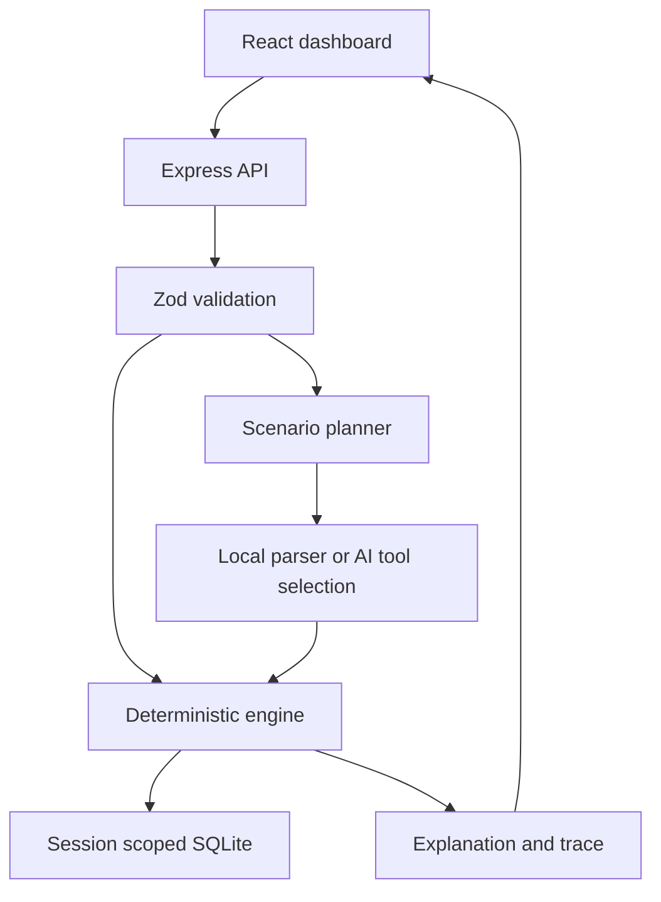

# Architecture

The browser previews results with the same engine as the backend. Saves always recalculate server-side; clients cannot submit a fabricated result. The store snapshots inputs and results, so branches remain reproducible after editing another scenario. Engine version is currently 1.0.0 and exported with data; rule migration is an explicit future task.

Sessions use 256-bit random bearer cookies. SQLite stores a SHA-256 hash of each token, not the raw cookie. Every read, branch parent lookup, and delete is filtered by owner. Removing a parent detaches its children instead of destroying the child snapshots. Expired sessions are removed when a new session starts and cascade-delete associated plans and metadata audit records.

Money is rounded to integer cents at share-price and monetary-event boundaries. Shares are whole integers; requested fractional allocations round down. Tax multiplication rounds to cents. The engine does not compound investments, read market prices, or extrapolate forecasts from the decorative hero illustration.

## API

| Endpoint | Behavior |
| --- | --- |
| GET /api/health | Health / engine version, public |
| POST /api/session | Create private demo workspace cookie |
| POST /api/calculate | Validate and compute a scenario |
| GET /api/scenarios | List current session's saved plans |
| POST /api/scenarios | Save a calculated snapshot / branch |
| DELETE /api/scenarios/:id | Remove owned plan; detach children |
| POST /api/agent | Select tool inputs and compute a proposal |

All POST/DELETE requests require JSON. Browser mutation origins must match APP_ORIGIN. This is a single-process service using synchronous SQLite; database calls are short and unsuitable for unbounded/high-volume workload. Multi-instance deployment requires shared storage architecture changes.
